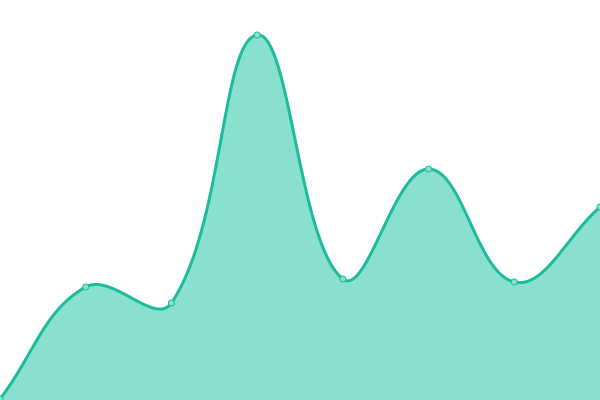

# [📈 Live Status](https://status.timecockpit.com): <!--live status--> **🟩 All systems operational**

This repository contains the open-source uptime monitor and status page for [software architects gmbh](https://www.software-architects.com), powered by [Upptime](https://github.com/upptime/upptime).

With [Upptime](https://upptime.js.org), you can get your own unlimited and free uptime monitor and status page, powered entirely by a GitHub repository. We use [Issues](https://github.com/software-architects/timecockpit-status/issues) as incident reports, [Actions](https://github.com/software-architects/timecockpit-status/actions) as uptime monitors, and [Pages](https://status.timecockpit.com) for the status page.

<!--start: status pages-->
<!-- This summary is generated by Upptime (https://github.com/upptime/upptime) -->
<!-- Do not edit this manually, your changes will be overwritten -->
<!-- prettier-ignore -->
| URL | Status | History | Response Time | Uptime |
| --- | ------ | ------- | ------------- | ------ |
|  [Web Client](https://web.timecockpit.com/version) | 🟩 Up | [web-client.yml](https://github.com/software-architects/timecockpit-status/commits/HEAD/history/web-client.yml) | 

 431ms
     
 | 

<a href="https://status.timecockpit.com/history/web-client">100.00%</a>
    

|  [API](https://api.timecockpit.com/version) | 🟩 Up | [api.yml](https://github.com/software-architects/timecockpit-status/commits/HEAD/history/api.yml) | 

 421ms
     
 | 

<a href="https://status.timecockpit.com/history/api">99.91%</a>
    

|  [Identity Server](https://auth.timecockpit.com/health) | 🟩 Up | [identity-server.yml](https://github.com/software-architects/timecockpit-status/commits/HEAD/history/identity-server.yml) | 

 382ms
     
 | 

<a href="https://status.timecockpit.com/history/identity-server">100.00%</a>
    

|  [Management Service](https://management.timecockpit.com/health) | 🟩 Up | [management-service.yml](https://github.com/software-architects/timecockpit-status/commits/HEAD/history/management-service.yml) | 

 660ms
     
 | 

<a href="https://status.timecockpit.com/history/management-service">100.00%</a>
    

|  [Website](https://www.timecockpit.com) | 🟩 Up | [website.yml](https://github.com/software-architects/timecockpit-status/commits/HEAD/history/website.yml) | 

 172ms
     
 | 

<a href="https://status.timecockpit.com/history/website">100.00%</a>
    

<!--end: status pages-->

[**Visit our status website →**](https://status.timecockpit.com)

## 📄 License

- Powered by: [Upptime](https://github.com/upptime/upptime)
- Code: [MIT](./LICENSE) © [Anand Chowdhary](https://anandchowdhary.com), supported by [Pabio](https://pabio.com)
- Data in the `./history` directory: [Open Database License](https://opendatacommons.org/licenses/odbl/1-0/)
